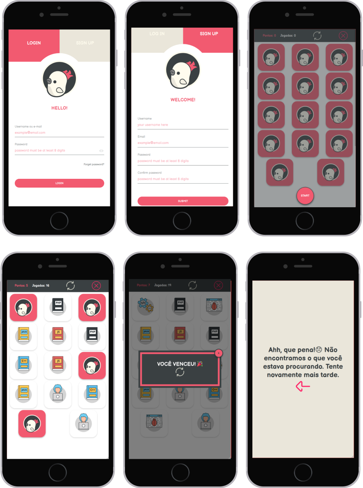

<p align="center">
  
</p>
<h1 align="center">
  Memory Game
</h1>

<br/>

<h3 align="center">Under construction 🚧 </h3>
<br/>

<!-- Badges -->
<p align="center">
  <!-- if your  -->
  

  

  

  

  

  

  <!-- if your app is a website deployed on Netlify -->
  <a href="https://app.netlify.com/sites/memorygamee/deploys" alt="Netlify Status">
    
  </a>


  
</p>
  <br/>

<!-- summary -->
<p align="center">
  <a href="#clipboard-description">Description</a>&nbsp;&nbsp;&nbsp;|&nbsp;&nbsp;&nbsp;
  <a href="#rocket-getting-started">Getting Started</a>&nbsp;&nbsp;&nbsp;|&nbsp;&nbsp;&nbsp;
  <a href="#art-layout">Layout</a>&nbsp;&nbsp;&nbsp;|&nbsp;&nbsp;&nbsp;
  <a href="#-folder-structure">Folder Structure</a>&nbsp;&nbsp;&nbsp;|&nbsp;&nbsp;&nbsp;
  <a href="#thinking-how-to-contribute">How to Contribute?</a>&nbsp;&nbsp;&nbsp;|&nbsp;&nbsp;&nbsp;


</p>

<br/>


## :clipboard: Description
Describe your application and what you learning with it. 😃

## :rocket: Getting Started

1. Download the repository

  - Using Git
```shell
  git clone https://github.com/<your-login>/<repository>.git
```
  - Using Github CLI
```shell
  gh repo clone <your-login>/<repository>
```
  > :bulb: or whichever way you prefer

2. Installation
```shell
  npm install
```

3. Execution
```shell
  npm run dev
```

## :art: Layout



## 📁 Folder structure 

### A quick look at the top-level directories inside the `root`.

    ./
     ├── css
     ├── img
     ├── /src
          ├── components
          ├── global
          ├── objects
          ├── pages


1.  **`css`**: global styles.
   
2.  **`img`**: all resources used. How icons, images, etc.
   
3.  **`src`**: all important files for the functioning of the site
   
    1.  **`components`**: reusable UI parts with important behaviors
    2.  **`global`**: global variables
    3.  **`objects`**: reusable structural parts of the UI
    4.  **`pages`**: each file is a website page.


## :thinking: How to Contribute?

* Fork this repository; 
* Create a branch with your feature: `git checkout -b my-feature`;
* Commit your changes: `git commit -m 'feat: My new feature'`;
* Push to your branch: `git push origin my-feature`.

After the merge of your pull request is done, you can delete your branch.


---

Build with 💙 By [Stefany Sá](https://twitter.com/stefany_vasc)

